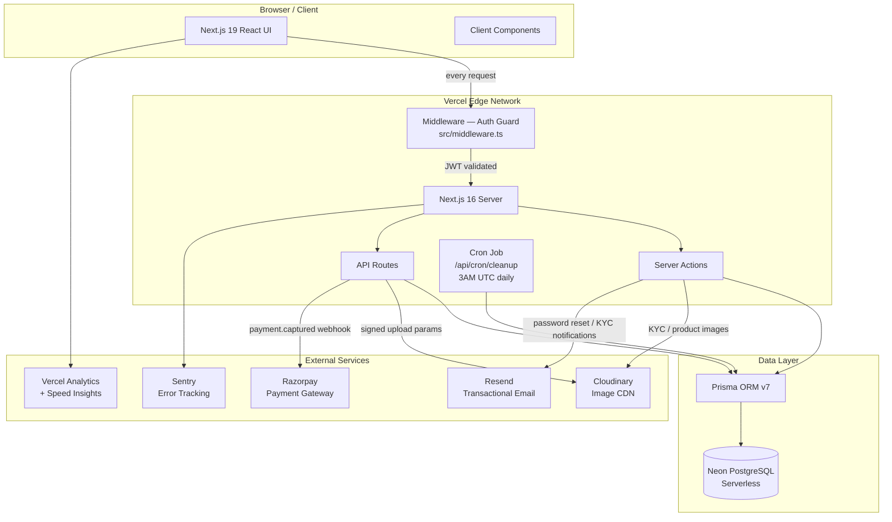
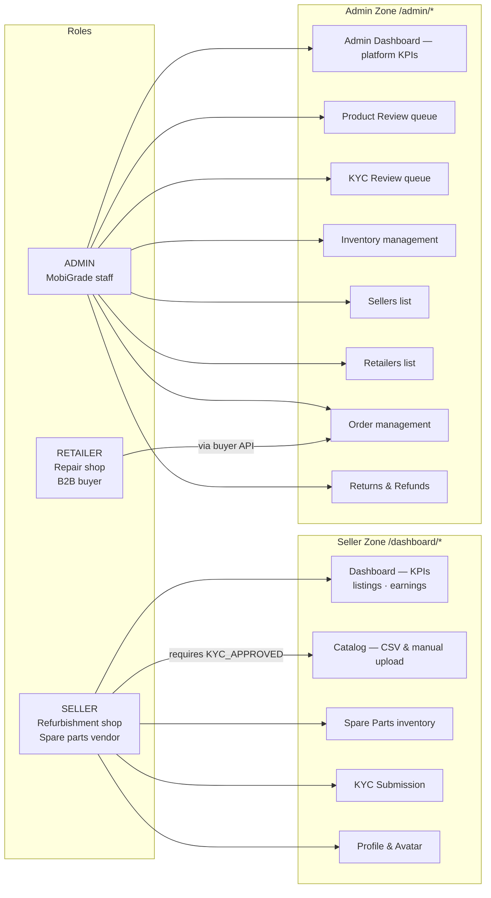
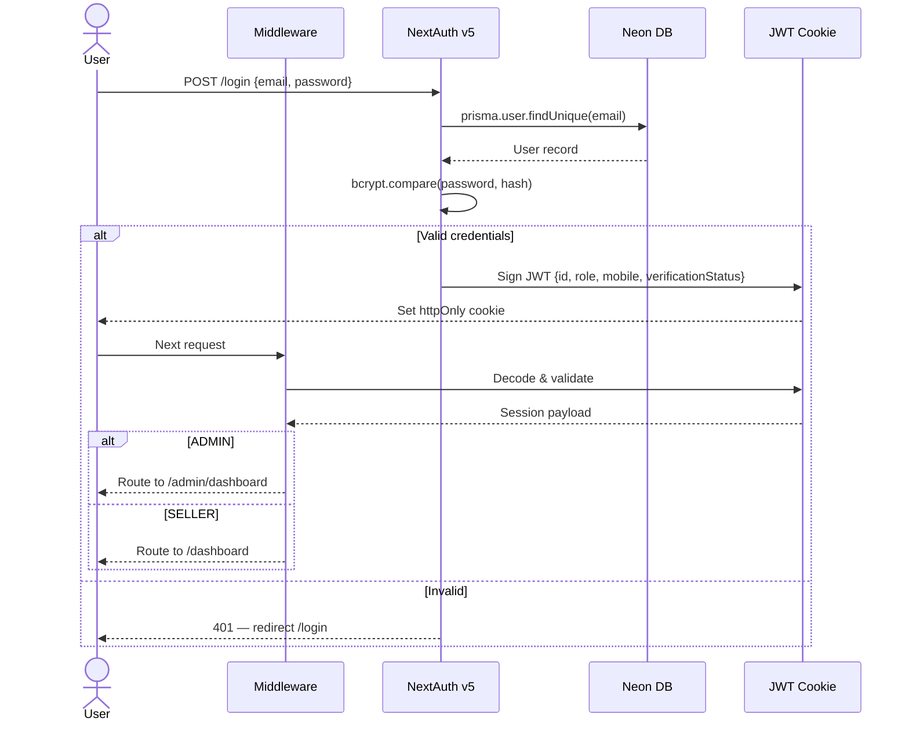
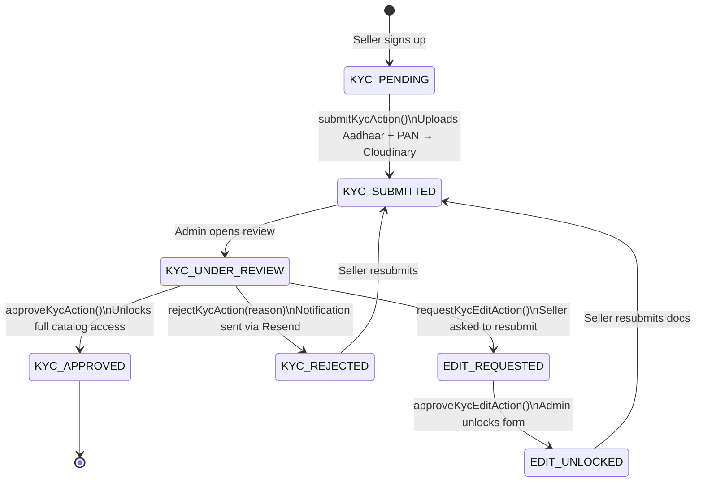
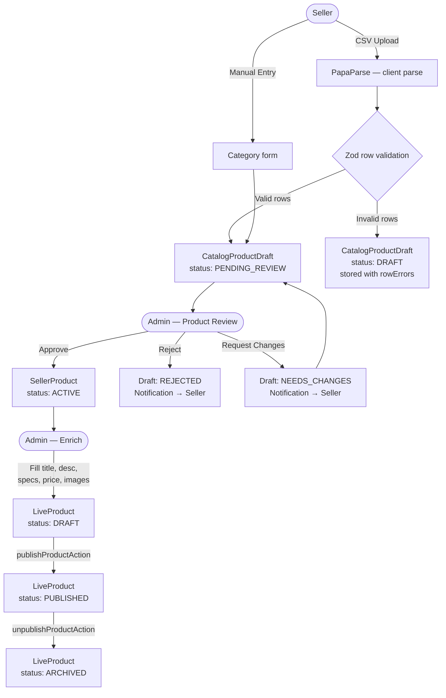
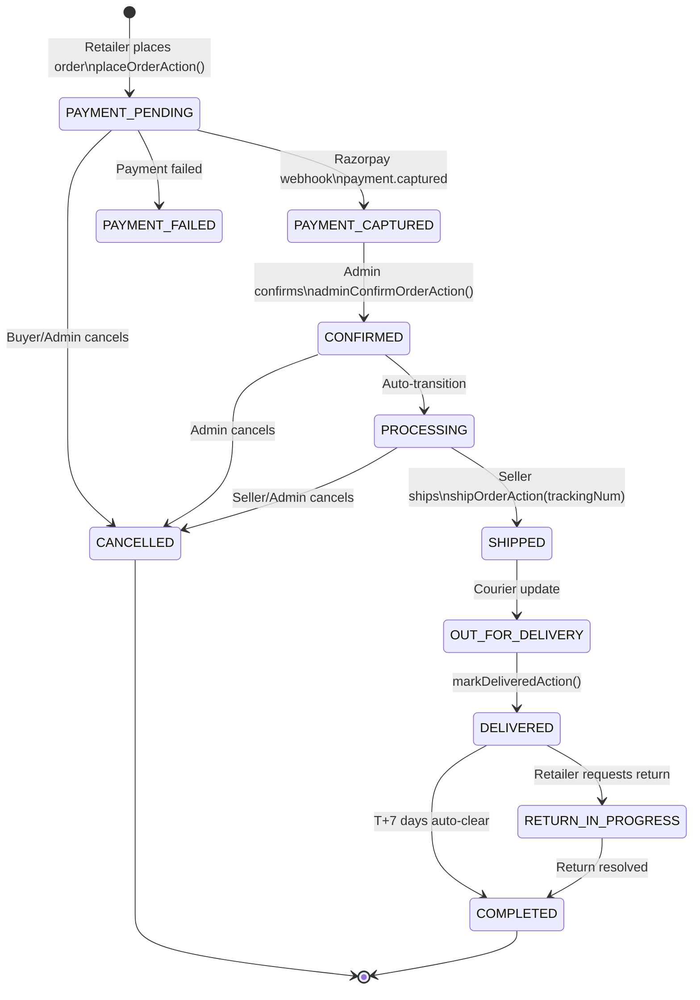
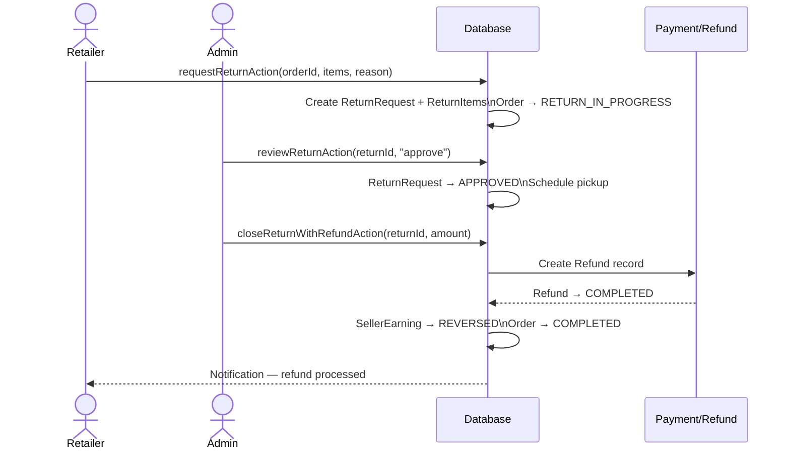
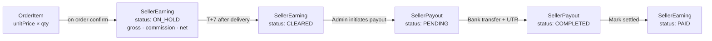
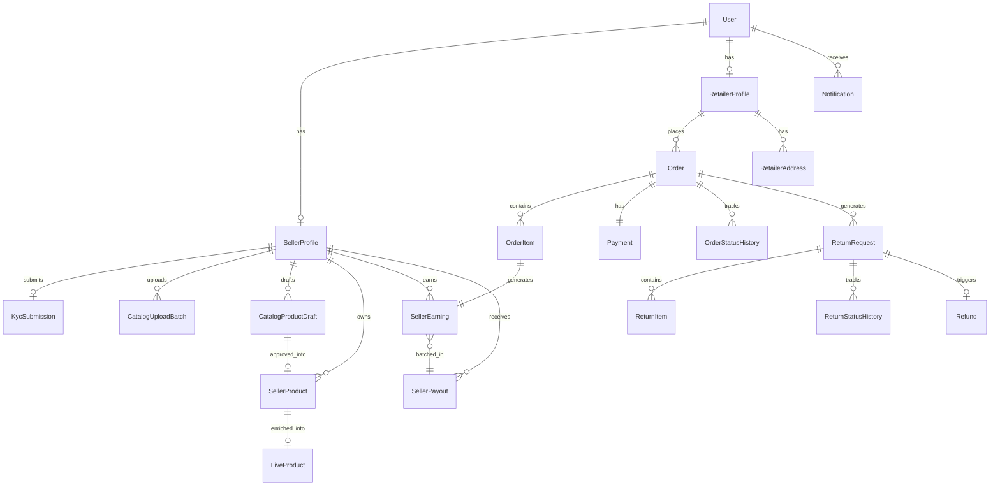

# MobiGrade Portal

> B2B seller & admin management platform for a zero-waste mobile refurbishment marketplace — connecting verified sellers, B2B retailers, and administrators through a structured catalog, KYC, order, and payout pipeline.

---

## System Architecture



---

## User Roles & Access Map



---

## Authentication Flow



---

## KYC Verification Flow



---

## Product Catalog Pipeline



---

## Order Lifecycle



---

## Return & Refund Flow



---

## Earnings & Payout Pipeline



---

## Data Model Overview



---

## Tech Stack

| Layer | Technology |
|---|---|
| Framework | Next.js 16.2 · React 19 |
| Auth | NextAuth v5 (beta) · bcryptjs · JWT |
| Database | Neon PostgreSQL (serverless) · Prisma ORM 7 |
| File Storage | Cloudinary (KYC docs, product images, avatars) |
| Email | Resend (password reset, KYC & order notifications) |
| Payments | Razorpay (webhook-driven, HMAC verified) |
| Validation | Zod 4 · PapaParse (CSV) |
| UI | Tailwind CSS 4 · Framer Motion · Lucide · Sonner |
| Charts | Chart.js + react-chartjs-2 |
| Observability | Sentry · Vercel Analytics · Speed Insights |
| Deployment | Vercel (Edge + Serverless Functions + Cron) |

---

## Key Security Measures

- **JWT strategy** — httpOnly signed cookies, no server-side session store
- **Role-based middleware** — every request gate-checked before reaching pages or API routes
- **KYC gating** — catalog access blocked until `verificationStatus === KYC_APPROVED`
- **Webhook HMAC** — Razorpay payloads verified with `RAZORPAY_WEBHOOK_SECRET`
- **Signed uploads** — Cloudinary uploads require a server-generated signature; credentials never exposed to the browser
- **Content Security Policy** — strict CSP headers on all routes (see `next.config.ts`)
- **Resource ownership** — every server action validates the requesting user owns the resource

---

## Project Structure

```
src/
├── app/
│   ├── (auth)/          # login · signup · forgot/reset password
│   ├── (seller)/        # dashboard · catalog · spare-parts · kyc · profile
│   ├── (admin)/         # dashboard · product-review · kyc-review · sellers · inventory
│   └── api/             # auth · orders · payments · kyc · cron · health
├── actions/             # server actions — auth · kyc · catalog · orders · admin
├── auth.config.ts       # edge-compatible NextAuth config (no Node.js imports)
├── auth.ts              # full NextAuth config — Credentials provider + Prisma
├── middleware.ts        # auth guard + role-based routing
├── components/          # shared UI components
├── lib/
│   ├── prisma.ts        # Prisma singleton — PrismaNeon adapter
│   ├── order-machine.ts # order state machine
│   ├── return-machine.ts# return state machine
│   └── validations/     # Zod schemas
└── types/               # global TypeScript types

prisma/
└── schema.prisma        # 20+ models — Users · KYC · Catalog · Orders · Earnings
```

---

## Deployment

Hosted on **Vercel** with GitHub integration (`PRO-GRAM-MER/mobigrade-portal`, `master` branch).

**Environment variables required:**

| Variable | Purpose |
|---|---|
| `DATABASE_URL` | Neon PostgreSQL connection string |
| `NEXTAUTH_SECRET` | JWT signing secret |
| `NEXTAUTH_URL` | Canonical app URL |
| `CLOUDINARY_CLOUD_NAME / API_KEY / API_SECRET` | Image management |
| `CLOUDINARY_FOLDER` | Upload folder prefix |
| `RESEND_API_KEY` | Transactional email |
| `RAZORPAY_WEBHOOK_SECRET` | Payment webhook verification |
| `CRON_SECRET` | Cron job authentication |
| `NEXT_PUBLIC_SENTRY_DSN` | Client-side error tracking |
